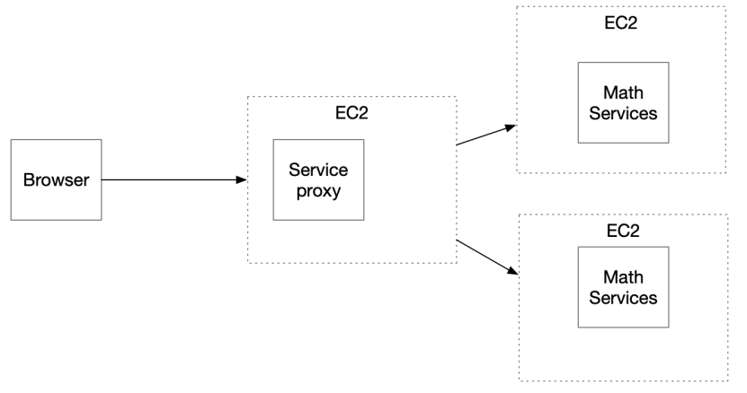

# MongoDB + Spark + AWS!

This is a repository that includes all the code needed to successfully deploy a basic _Client-Server_ architecture to AWS, built with Java (Spark) and basic web technologies (HTML, JavaScript, CSS) NGINX and also Docker and Docker compose as tools for orchestating the containers.

## Architecture

---


This is a simple _Client-Server_ architecture using an **APIRest** approach. The **backend** is a Spark application dockerized that exposes two endpoints that the **frontend** consumes (GET and POST on the same endpoint). The communication is based on the REST protocol using **JSON** as standard for sending and receiving messages.

The **frontend** is served in a docker container which uses de **nginx** image as base, the **backend** is served in a docker container using the **openjdk:8** image and the **database** is served in a docker container which uses the **mongo:3.6.1** image.

### API

---

**Base URL (local)**

```url
http://localhost:8087
```
**Base URL (AWS)**

```url
https://ec2-3-87-21-7.compute-1.amazonaws.com:8087
```

### ENDPOINTS

---

For getting all the messages, make a **GET** request to this endpoint:

```url
/api/v1/messages
```

For sending a new message, make a **POST** request to this endpoint:

```url
/api/v1/messages
```

### REQUESTS

---

To send a new message to the application using an HTTP Client such as _postman_ you must send the body of the **POST** request in a format like this:

```json
{
  "text": "Your message here"
}
```

### LINKS

---

**Backend**
Local:
```url
http://localhost:8087
```

AWS:
```url
https://ec2-3-87-21-7.compute-1.amazonaws.com:8087
```

**Frontend**

Local:
```url
http://localhost:80
```

AWS:
```url
https://ec2-3-87-21-7.compute-1.amazonaws.com:80
```

## Run the project locally!

---

Download or clone the project and run:

```bash
mvn compile
mvn package
```

Then, open a _terminal_ and make sure to run the **docker service** and run:

```bash
docker-compose up
```
* If it does'nt work, run the command with **sudo** priviledges.


## Built With

- [Spark](https://sparkjava.com/) - As the Java framework for the backend.
- HTML and CSS - As the main technologies for developing the UI.
- [JavaScript](https://developer.mozilla.org/es/docs/Web/JavaScript) - As the language used in the client for creating experiences and handling user events.
- Docker and docker-compose - As tools for orchestating the containers.

## Author

- **Juan David Murillo** - [Github](https://github.com/juancho20sp) | [Twitter](https://twitter.com/juancho20sp)<br/>
  Student at: [Escuela Colombiana de Ingeniería Julio Garavito](https://www.escuelaing.edu.co/es/) <br/>
  2022

## License

This is an _open source_ project.

### Thanks for checking out!
