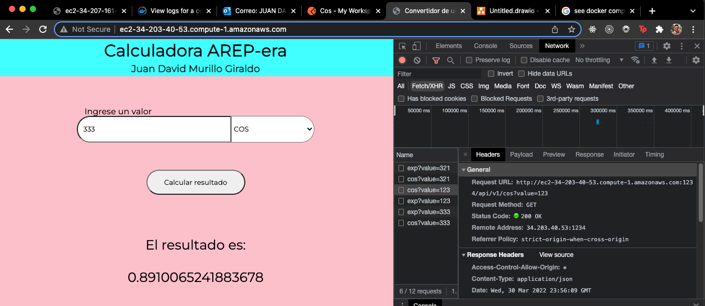

# Parcial 2 - Juan David Murillo

Este es el repositorio del parcial práctico de ARSW.

## Architecture

---
### Arquitectura planteada por el profesor


### Arquitectura realizada :c


Esta es una arquitectura _Cliente-Servidor_ con balanceo de cargas utilizando un estilo basado en **APIRest**. El backend es una aplicación Dockerizada de spark, dividida en dos partes: **Servidor Web** y **Servidor Proxy**. El servidor web se encarga de responder a las peticiones del servidor proxy y el servidor proxy se encarga de distribuir las peticiones sobre el total de servidores web disponibles.

El **frontend** está desplegado en un contenedor basado en una imagen de **nginx** y el **backend** está basado en una imagen de **openjdk:8**.

## Round Robin
Toda la lógica correspondiente al algoritmo de _Round Robin_ y al _balanceo de cargas_ se encuentra en el contenedor **Proxy**. En el archivo Proxy/src/main/java/co/edu/escuelaing/parcial2/proxy/SparkProxy.java se encuentra todo el código correspondiente a esta funcionalidad.

### Evidencia
- Proyecto funcionando:



### API

---

**Base URL (local)**

```url
http://localhost:1234
```
**Base URL (AWS)**

```url
http://ec2-34-203-40-53.compute-1.amazonaws.com/
```

### ENDPOINTS

---
Para hacer un cálculo de la función **cos** debemos hacer una petición a este endpoint:

```url
/api/v1/cos
```

Para hacer un cálculo de la función **exp** debemos hacer una petición a este endpoint:

```url
/api/v1/exp
```

### REQUESTS

---
Todas las peticiones tienen la misma forma, sin importar a qué función le apuntemos debemos siempre pasarle un _queryParam_ llamado **value** acompañado del valor que queremos pasar como argumento a la función, así:

```url
/api/v1/exp?value=123.32
```

### LINKS

---

**Backend**
Local:
```url
http://localhost:4567
```

AWS:
```url
http://ec2-34-203-40-53.compute-1.amazonaws.com:1234
```

**Frontend**

Local:
```url
http://localhost:80
```

AWS:
```url
http://ec2-34-203-40-53.compute-1.amazonaws.com:80/
```

## Corramos el proyecto de forma local!

---

Descargue o clone el proyecto y dentro de la carpeta ejecute:

```bash
mvn compile
mvn package
```
Luego, abra una _terminal_ y asegurese de que el **demonio de docker** esté corriendo y ejecute:

```bash
docker-compose up --scale web=2
```
* Si esto no funciona ejecute el comando con privilegios de sudo.
* Se utiliza la bandera _--scale [CONTAINER]=[INSTANCES]_ para desplegar simúltaneamente varias instancias de un contenedor.

## Correr el proyecto en EC2
---

* Cree una instancia de EC2 y conéctese a ella.
* Instale git en la instancia de EC2

```bash
sudo yum update -y
sudo yum install git -y
```

* Instale Docker en la instancia de EC2

```bash
sudo yum install docker -y
sudo usermod -a -G docker ec2-user
sudo service docker start
```

* Instale docker-compose en la instancia de EC2:

```bash
sudo curl -L https://github.com/docker/compose/releases/download/1.22.0/docker-compose-$(uname -s)-$(uname -m) -o /usr/local/bin/docker-compose

sudo chmod +x /usr/local/bin/docker-compose
```

* Si tiene porblemas con docker-compose:
```bash
sudo usermod -aG docker $USER
sudo ln -s /usr/local/bin/docker-compose /usr/bin/docker-compose
sudo service docker restart
```

* Clone el repositorio en la instancia de EC2, entre al proyecto y ejecute:

```bash
sudo docker-compose up --scale web=2
```


## Construído con

- [Spark](https://sparkjava.com/) - Como el framework de Java para el backend..
- HTML y CSS - Como tecnologías principales para el desarrollo de la interfaz de usuario.
- [JavaScript](https://developer.mozilla.org/es/docs/Web/JavaScript) - Como el lenguaje utilizado en el cliente para manejar eventos y crear experiencias de usuario.
- Docker y docker-compose - Como herramientas para orquestar los contenedores.
## Author

- **Juan David Murillo** - [Github](https://github.com/juancho20sp) | [Twitter](https://twitter.com/juancho20sp)<br/>
  Estudiante en: [Escuela Colombiana de Ingeniería Julio Garavito](https://www.escuelaing.edu.co/es/) <br/>
  2022


### Gracias por revisar!
